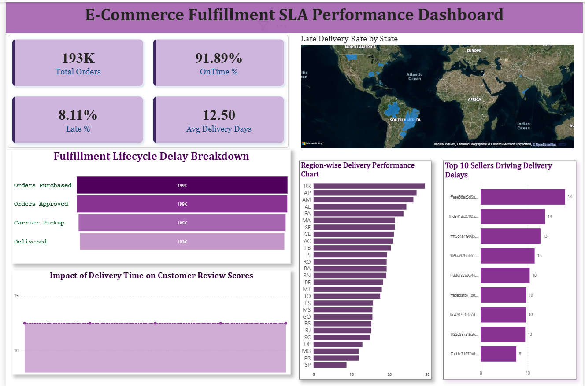

# eCommerce-Fulfillment-SLA-Delivery-Performance-Analytics-Dashboard-SQL-Power-BI-

## 📊 Project Overview

This project analyzes end-to-end delivery performance for an eCommerce logistics pipeline using SQL and Power BI. The objective was to identify operational bottlenecks affecting delivery timelines, SLA compliance, and seller-level fulfillment efficiency across 190K+ orders.

The dashboard provides actionable insights into approval delays, carrier pickup inefficiencies, last-mile delivery risks, and geographic regions with higher late-delivery probability.

---

## 🎯 Business Problem

Late deliveries directly impact customer satisfaction, return rates, and logistics costs. This project simulates a real-world operations analytics scenario where stakeholders need visibility into:

• Where delivery delays occur
• Which sellers contribute most to SLA breaches
• Which regions face higher logistics risk
• How fulfillment performance changes across lifecycle stages

---

## 🧰 Tools & Technologies Used

SQL (MySQL)

Power BI

Data Modeling

DAX Measures

Data Cleaning & Transformation

Logistics KPI Design

---

## 📂 Dataset

Brazilian Olist eCommerce dataset (190k+ real-world orders)

Includes:

Customers
Orders
Order Items
Products
Sellers
Reviews

Dataset Source:
https://www.kaggle.com/datasets/olistbr/brazilian-ecommerce

---

## ⚙️ Project Workflow

Step 1 — Data Import

Loaded CSV datasets into MySQL relational database

Step 2 — Data Cleaning

Filtered delivered orders
Handled null timestamps
Standardized delivery lifecycle columns

Step 3 — Feature Engineering (SQL View Creation)

Created delivery_sla_view calculating:

Approval delay

Carrier pickup delay

Last-mile delivery delay

Total fulfillment cycle time

Delivery SLA status

---

## 📈 KPI Metrics Designed

Total Orders

On-Time Delivery %

Late Delivery %

Average Delivery Time

Approval Delay

Carrier Pickup Delay

Last-Mile Delay

Seller Delay Contribution

Regional SLA Risk Distribution

---

## 📊 Dashboard Insights

Key findings:

• Majority of delays occur before carrier pickup stage
• Small group of sellers contributes disproportionately to SLA violations
• Regional clusters show higher late-delivery probability
• Last-mile delivery variability impacts total fulfillment performance

---

## 📉 Visualizations Built

Executive KPI Summary Cards

Fulfillment Lifecycle Funnel

State-Level Delivery Risk Heatmap

Seller Delay Leaderboard (Top 10 Bottleneck Sellers)

Lifecycle Delay Breakdown Metrics

---

## 🧠 Business Impact

This dashboard enables operations teams to:

Identify fulfillment bottlenecks

Monitor SLA compliance

Prioritize high-risk sellers

Improve logistics planning decisions

Optimize regional delivery performance

---

## 📌 Skills Demonstrated

SQL Joins

Window Functions

View Creation

KPI Engineering

Power BI Dashboard Design

DAX Measures

Data Modeling

Operations Analytics Thinking

Logistics Performance Analysis

---

## 🚀 Future Improvements

Add time-series trend analysis

Build delivery prediction model

Integrate warehouse-level performance tracking

Deploy dashboard using Power BI Service

## 📬 Connect
**Granthi Satvinder Singh**  
📧 granthisatvindersingh@gmail.com  
🔗 [LinkedIn](https://linkedin.com/in/granthi14)
